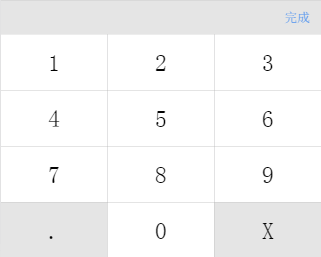

## vue-keyboard

a vue keyboard component

### Install

```bash
npm install vue-keyboard2 -S

yarn install vue-keyboard2
```

### Quickstart
```javascript
require('vue-keyboard/dist/vue-keyboard.css');

// in ES6 modules
import keyboard from 'vue-keyboard';

// in CommonJS
const keyboard = require('vue-keyboard');

// in Global variable
const keyboard = VueKeyboard;

Vue.component('c-keyboard',keyboard);
```
```html
<c-keyboard :pwd="pwd" :len="len"></c-keyboard>
```

### Params

`props`
-  `show`: whether show the keyboard, type Boolean, default is false
-  `headbar` : whether show the headbar, type Boolean, default is false
-  `loading`: whether show the loading, type Boolean, default is false

`events`
-  `onchange` : get the num clicked, type Function, params is num
-  `onhide`: trigger when the keyboard hide

### Preview

